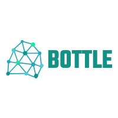

# 

Bottle is the core shard needed for scientific computing with Crystal

- **Website:** https://www.crystaldata.org
- **Documentation:** https://docs.crystaldata.org/
- **Source code:** https://github.com/crystaldata/bottle
- **Contributing:** https://www.numpy.org/devdocs/dev/index.html
- **Bug reports:** https://github.com/crystaldata/bottle/issues

It provides:

- efficient 1 and 2-dimensional data structures
- sophisticated reduction and accumulation routines
- data structures that can easily be passed to C libraries
- powerful linear algebra routines backed by LAPACK and BLAS

Contributing
------------
Bottle requires help in many different ways to continue to grow as a shard.
Work such as high level documentation and code quality checks are needed just
as much as API enhancements.  If you are considering larger scale contributions
that extend beyond minor enhancements and bug fixes, contact Crystal Data
in order to be added to the organization to gain access to review and merge
permissions.
