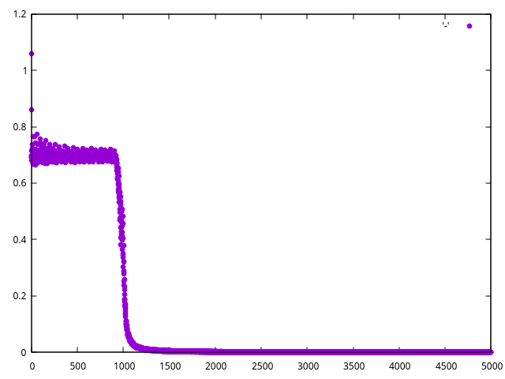

## Basic XOR Classifier

The following implements a simple XOR classifier to show how to use
`num.cr`'s `Network` class.  Plotting is done via `ishi`.

```crystal
ctx = Num::Grad::Context(Tensor(Float64)).new

bsz = 32

x_train_bool = Tensor.random(0_u8...2_u8, [bsz * 100, 2])

y_bool = x_train_bool[..., ...1] ^ x_train_bool[..., 1...]

x_train = ctx.variable(x_train_bool.as_type(Float64))
y = y_bool.as_type(Float64)

net = Num::NN::Network.new(ctx) do
  linear 2, 3
  relu
  linear 3, 1
  sgd 0.7
  sigmoid_cross_entropy_loss
end

losses = [] of Float64

50.times do |epoch|
  100.times do |batch_id|
    offset = batch_id * 32
    x = x_train[offset...offset + 32]
    target = y[offset...offset + 32]

    y_pred = net.forward(x)

    loss = net.loss(y_pred, target)

    puts "Epoch is: #{epoch}"
    puts "Batch id: #{batch_id}"
    puts "Loss is: #{loss.value.value}"
    losses << loss.value.value

    loss.backprop
    net.optimizer.update
  end
end
```

```
...
Epoch is: 49
Batch id: 95
Loss is: 0.00065050072686102
Epoch is: 49
Batch id: 96
Loss is: 0.0006024037564266797
Epoch is: 49
Batch id: 97
Loss is: 0.0005297538443899917
Epoch is: 49
Batch id: 98
Loss is: 0.0005765025171222869
Epoch is: 49
Batch id: 99
Loss is: 0.0005290653040218895
```

The Network learns this function very quickly, as XOR is one of the simplest
distributions to hit.  Since the training data is so limited, accuracy
can be a bit jagged, but eventually the network smooths out.

### Loss over time


