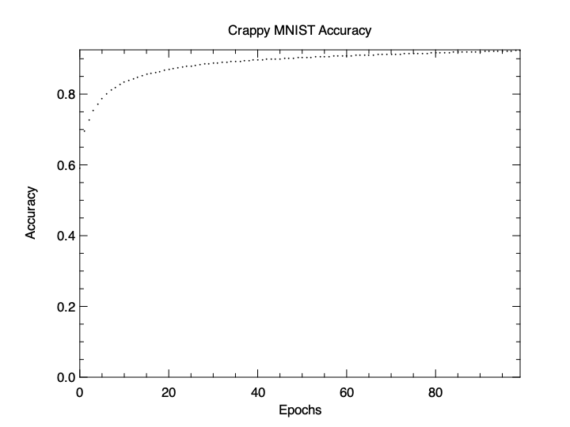

## Crappy MNIST

Learning the MNIST dataset on flat data, with no convolutional layers,
is a sub-par approach, but why not show how it works anyways?

Here is a basic, linear network that achieves over 90% accuracy
after learning the training set.

```crystal
net = Num::NN::Network.new(ctx) do
  linear 784, 32
  relu
  linear 32, 10
  softmax_cross_entropy_loss
  sgd 0.01
end

batch_size = 32

accuracies = [] of Float64

100.times do |epoch|
  y_trues = [] of Int32
  y_preds = [] of Int32

  (y_train.shape[0] // batch_size).times do |batch_id|
    offset = batch_id * batch_size
    x = x_train[offset...offset + batch_size]
    target = y_train[offset...offset + batch_size]

    output = net.forward(x)

    loss = net.loss(output, target)

    y_trues += target.argmax(axis: 1).to_a
    y_preds += output.value.argmax(axis: 1).to_a

    loss.backprop
    net.optimizer.update
  end

  accuracy = y_trues.zip(y_preds).map { |t, p| (t == p).to_unsafe }.sum / y_trues.size
  accuracies << accuracy

  puts "Epoch: #{epoch} | Accuracy: #{accuracy}"
end
```

```
Epoch: 0 | Accuracy: 0.593649946638207
Epoch: 1 | Accuracy: 0.6986726254002135
Epoch: 2 | Accuracy: 0.7302894877267876
Epoch: 3 | Accuracy: 0.7550860458911419
...
Epoch: 96 | Accuracy: 0.9243930096051227
Epoch: 97 | Accuracy: 0.9246764941302028
Epoch: 98 | Accuracy: 0.9249933297758804
Epoch: 99 | Accuracy: 0.9251767609391676
Test accuracy: 0.922092209220922
```

### Accuracy over time


