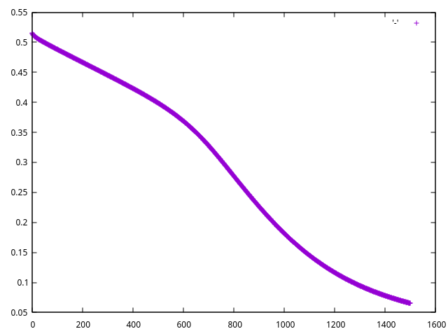

### Custom Layer in Classifier

Num.cr implements some basic activation layers for a Network, but users
can also define their own, to have much more control over their Network
design.  The only requirement is that it must implement a `forward`
and `backward` method.  For layers that call activation and derivation
functions, inhert from `Num::NN::ActivationLayer` rather than `Num::NN::Layer`

The following example uses a ReLU activation layer defined by the user, again
to learn the XOR function.

```crystal
require "num"
require "ishi"

# Basic XOR input data

x_train = [
  [0, 0, 0],
  [0, 0, 1],
  [0, 1, 0],
  [0, 1, 1],
  [1, 0, 0],
  [1, 0, 1],
  [1, 1, 0],
  [1, 1, 1],
].to_tensor.as_type(Float64).transpose

y_train = [[0, 1, 1, 1, 1, 1, 1, 0]].to_tensor.as_type(Float64)

# An example of defining a custom layer to be used in
# a Network
class MyCustomActivation(T) < Num::NN::ActivationLayer(T)
  def activate(input : Tensor(T)) : Tensor(T)
    Num.max(T.new(0), input)
  end

  def derive(gradient : Tensor(T)) : Tensor(T)
    gradient.map do |i|
      i >= 0 ? T.new(1) : T.new(0)  ishi:
    github: toddsundsted/ishi
    end
  end
end

m = x_train.shape[1]
epochs = 1500

options = {
  learning_rate: 0.1
}

costs = [] of Float64

# Classes provided will be used instead of looking up via symbols
# to allow for custom, user-defined classes
net = Num::NN::Network(Float64).new(**options) do
  layer(3, 6, :tanh)
  layer(6, 6, MyCustomActivation)
  layer(6, 1, :sigmoid)
end

# Using the same standard log loss as the generic example
epochs.times do
  a = net.forward(x_train)
  cost = 1/m * Num.sum(Num::NN.logloss(y_train, a))
  costs << cost
  loss_gradient = Num::NN.d_logloss(y_train, a)
  net.backward(loss_gradient)
end

puts net.forward(x_train)

Ishi.new do
  plot((0...costs.size).to_a, costs)
end
```

In this particular instance, the ReLU layer does basically nothing, the
results stay the same:

```crystal
[[0.0873788, 0.989138 , 0.975184 , 0.948848 , 0.983739 , 0.955604 ,
  0.947117 , 0.202448 ]]
```

### Loss over time


