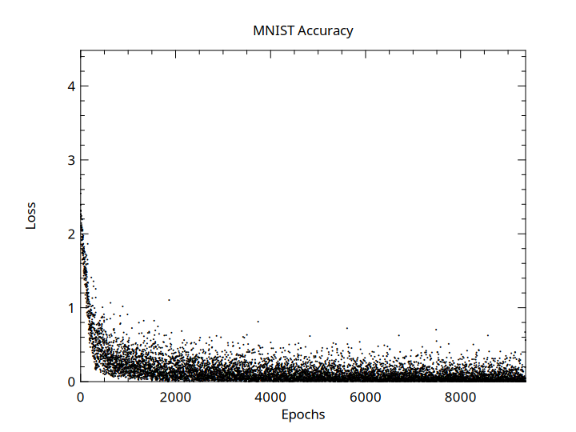

## MNIST

This is an example of how to use convolutional layers
and max pooling to learn the MNIST dataset.  Using this approach,
our network achieves > 97% accuracy on the training dataset.

```crystal
net = Num::NN::Network.new(ctx) do
  input [1, 28, 28]
  conv2d 20, 5, 5
  relu
  maxpool({2, 2}, {0, 0}, {2, 2})
  conv2d 20, 5, 5
  maxpool({2, 2}, {0, 0}, {2, 2})
  flatten
  linear 10
  relu
  linear 10
  softmax_cross_entropy_loss
  sgd 0.01
end
```

```
Epoch: 0 | Accuracy: 0.8644276947705443
Epoch: 1 | Accuracy: 0.9558931430096052
Epoch: 2 | Accuracy: 0.9677494663820705
Epoch: 3 | Accuracy: 0.9735358858057631
Epoch: 4 | Accuracy: 0.9770711045891142
```

### Accuracy over time


