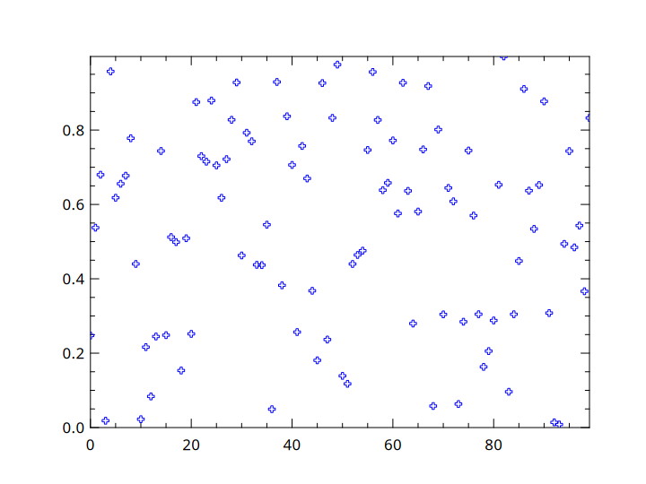

## Simple Scatter Plot

Using [PLplot](http://plplot.sourceforge.net/index.php), a fantastic library for scientific plotting, charts are extremely easy to create with Num.cr.

```crystal
x = (0...100)
y = Tensor(Float64).rand([100])

Num::Plot::Plot.plot do
  term nil
  scatter x, y, code: 14, color: 2
end
```


